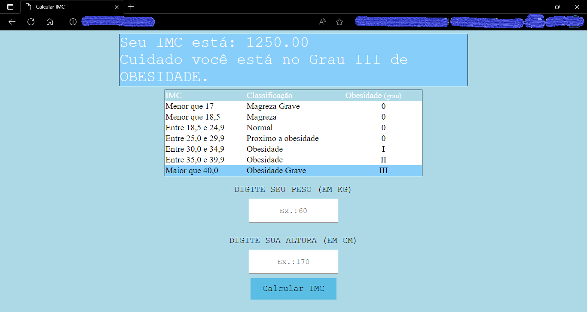
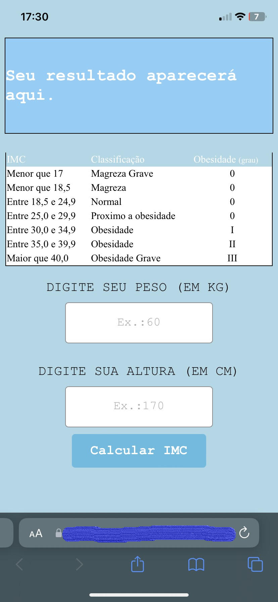

<h1 style="text-align:center"> Calculadora IMC  simples e funcioal </h1>

Implementei uma versão antiga de um simples projeto que fiz, acresentei novas funções que aprendi durante meus estudos. 

Pretendo aumentar suas funcionalidades e deixa-lo melhor conforme aprendo novas coisas.

## VERSÃO WEB 

## VERSÃO MOBILE
